# First RQ of SCL30a DEGs
Dale Richardson  
`r format(Sys.Date(), "%B %d, %Y")`  


## Description
Here I will experiment with the [https://cran.r-project.org/web/packages/MCMC.qpcr/index.html](MCMC qPCR package) from Mikhail V. Matz. 

From the Reference Manual:

*Quantitative RT-PCR data are analyzed using generalized linear mixed models based on lognormal-Poisson error distribution, fitted using MCMC. Control genes are not required but can be incorporated as Bayesian priors or, when template abundances correlate with conditions, as trackers of global effects (common to all genes). The package also implements a lognormal model for higher-abundance data and a "classic" model involving multigene normalization on a by-sample basis. Several plotting functions are included to extract and visualize results. The detailed tutorial is available here: <http://bit.ly/1Nwo4CB>.*

## Data processing


```r
## load the MCMC qpcr package, dplyr and tidyr
library(MCMC.qpcr)
library(dplyr)
library(tidyr)

## read in the qpcr input data files
## Skip the first 11 lines, which contain comments and set na.strings
myData <- read.csv("Well\ Results.csv", header = TRUE, skip = 11, na.strings = c("","-", "Undetermined")) %>% 
        select(sample = Sample.Name, gene = Target.Name, Cq) %>%
        filter(sample != "No Sample", gene!= "GA20")

## write out simpler output
write.csv(myData, file = "tmp.csv", row.names = FALSE, quote = FALSE)
```

With the file, `tmp.csv`, I have used excel to rearrange the data so that it is in a wider format in accordance with the example data frame of the MCMC.qpcr tutorial. This file is called, `mcmc_formatted_RQ.csv`. I should spend some time doing this in R so that the analysis is fully reproducible...


```r
## load in the processed csv files
## efficiencies
eff <- read.csv("efficiency_updated.csv", header = TRUE, stringsAsFactors = FALSE)

## cqs
rq.data <- read.csv("mcmc_formatted_RQ.csv", header = TRUE, stringsAsFactors = FALSE)
#rq.data <- read.csv("proper_sample_col.csv", header = TRUE, stringsAsFactors = FALSE)
```

From the tutorial:

*Recalculating the data into molecule counts and reformatting:
One of the central ideas of the MCMC.qpcr methodology is to treat qPCR data as molecule count data. Function `cq2counts()` does the reformatting. It needs to be told the name of the main dataset, the name of efficiencies dataset, and also which columns correspond to the actual qPCR data for genes (‘genecols‘) and which columns contain experimental conditions (‘condcols‘):
`qs=cq2counts(data=beckham.data, effic=beckham.eff, genecols=c(4:13),condcols=c(1:3))`*

## Running the model

```r
#, results = "hide"
## recalculate data into molecule counts and reformat
qs <- cq2counts(data = rq.data, effic = eff, genecols = c(4:13), condcols = c(1:3), Cq1 = 39)

# on previous runs, i saw that the plateau of acceptance values was reached at iteration 6000.
# therefore, I need to change the nitt=16000 and burnin=6000.
# hiding the model sanity check output
informed_d <- mcmc.qpcr(
        fixed = "genotype+condition",
        random = "sample",
        data = qs,
        controls = c("ef1a", "ubc21"),
        m.fix = 1.2,
        pr = TRUE,
        pl = TRUE,
        nitt = 16000,
        burnin = 6000
)
```

```
## $PRIOR
## $PRIOR$B
## $PRIOR$B$mu
##  [1] 0 0 0 0 0 0 0 0 0 0 0 0 0 0 0 0 0 0 0 0 0 0 0 0 0 0 0 0 0 0 0 0 0 0 0
## [36] 0 0 0 0 0
## 
## $PRIOR$B$V
##        [,1]  [,2]  [,3]  [,4]  [,5]  [,6]  [,7]  [,8]  [,9] [,10] [,11]
##  [1,] 1e+08 0e+00 0e+00 0e+00 0e+00 0e+00 0e+00 0e+00 0e+00 0e+00 0e+00
##  [2,] 0e+00 1e+08 0e+00 0e+00 0e+00 0e+00 0e+00 0e+00 0e+00 0e+00 0e+00
##  [3,] 0e+00 0e+00 1e+08 0e+00 0e+00 0e+00 0e+00 0e+00 0e+00 0e+00 0e+00
##  [4,] 0e+00 0e+00 0e+00 1e+08 0e+00 0e+00 0e+00 0e+00 0e+00 0e+00 0e+00
##  [5,] 0e+00 0e+00 0e+00 0e+00 1e+08 0e+00 0e+00 0e+00 0e+00 0e+00 0e+00
##  [6,] 0e+00 0e+00 0e+00 0e+00 0e+00 1e+08 0e+00 0e+00 0e+00 0e+00 0e+00
##  [7,] 0e+00 0e+00 0e+00 0e+00 0e+00 0e+00 1e+08 0e+00 0e+00 0e+00 0e+00
##  [8,] 0e+00 0e+00 0e+00 0e+00 0e+00 0e+00 0e+00 1e+08 0e+00 0e+00 0e+00
##  [9,] 0e+00 0e+00 0e+00 0e+00 0e+00 0e+00 0e+00 0e+00 1e+08 0e+00 0e+00
## [10,] 0e+00 0e+00 0e+00 0e+00 0e+00 0e+00 0e+00 0e+00 0e+00 1e+08 0e+00
## [11,] 0e+00 0e+00 0e+00 0e+00 0e+00 0e+00 0e+00 0e+00 0e+00 0e+00 1e+08
## [12,] 0e+00 0e+00 0e+00 0e+00 0e+00 0e+00 0e+00 0e+00 0e+00 0e+00 0e+00
## [13,] 0e+00 0e+00 0e+00 0e+00 0e+00 0e+00 0e+00 0e+00 0e+00 0e+00 0e+00
## [14,] 0e+00 0e+00 0e+00 0e+00 0e+00 0e+00 0e+00 0e+00 0e+00 0e+00 0e+00
## [15,] 0e+00 0e+00 0e+00 0e+00 0e+00 0e+00 0e+00 0e+00 0e+00 0e+00 0e+00
## [16,] 0e+00 0e+00 0e+00 0e+00 0e+00 0e+00 0e+00 0e+00 0e+00 0e+00 0e+00
## [17,] 0e+00 0e+00 0e+00 0e+00 0e+00 0e+00 0e+00 0e+00 0e+00 0e+00 0e+00
## [18,] 0e+00 0e+00 0e+00 0e+00 0e+00 0e+00 0e+00 0e+00 0e+00 0e+00 0e+00
## [19,] 0e+00 0e+00 0e+00 0e+00 0e+00 0e+00 0e+00 0e+00 0e+00 0e+00 0e+00
## [20,] 0e+00 0e+00 0e+00 0e+00 0e+00 0e+00 0e+00 0e+00 0e+00 0e+00 0e+00
## [21,] 0e+00 0e+00 0e+00 0e+00 0e+00 0e+00 0e+00 0e+00 0e+00 0e+00 0e+00
## [22,] 0e+00 0e+00 0e+00 0e+00 0e+00 0e+00 0e+00 0e+00 0e+00 0e+00 0e+00
## [23,] 0e+00 0e+00 0e+00 0e+00 0e+00 0e+00 0e+00 0e+00 0e+00 0e+00 0e+00
## [24,] 0e+00 0e+00 0e+00 0e+00 0e+00 0e+00 0e+00 0e+00 0e+00 0e+00 0e+00
## [25,] 0e+00 0e+00 0e+00 0e+00 0e+00 0e+00 0e+00 0e+00 0e+00 0e+00 0e+00
## [26,] 0e+00 0e+00 0e+00 0e+00 0e+00 0e+00 0e+00 0e+00 0e+00 0e+00 0e+00
## [27,] 0e+00 0e+00 0e+00 0e+00 0e+00 0e+00 0e+00 0e+00 0e+00 0e+00 0e+00
## [28,] 0e+00 0e+00 0e+00 0e+00 0e+00 0e+00 0e+00 0e+00 0e+00 0e+00 0e+00
## [29,] 0e+00 0e+00 0e+00 0e+00 0e+00 0e+00 0e+00 0e+00 0e+00 0e+00 0e+00
## [30,] 0e+00 0e+00 0e+00 0e+00 0e+00 0e+00 0e+00 0e+00 0e+00 0e+00 0e+00
## [31,] 0e+00 0e+00 0e+00 0e+00 0e+00 0e+00 0e+00 0e+00 0e+00 0e+00 0e+00
## [32,] 0e+00 0e+00 0e+00 0e+00 0e+00 0e+00 0e+00 0e+00 0e+00 0e+00 0e+00
## [33,] 0e+00 0e+00 0e+00 0e+00 0e+00 0e+00 0e+00 0e+00 0e+00 0e+00 0e+00
## [34,] 0e+00 0e+00 0e+00 0e+00 0e+00 0e+00 0e+00 0e+00 0e+00 0e+00 0e+00
## [35,] 0e+00 0e+00 0e+00 0e+00 0e+00 0e+00 0e+00 0e+00 0e+00 0e+00 0e+00
## [36,] 0e+00 0e+00 0e+00 0e+00 0e+00 0e+00 0e+00 0e+00 0e+00 0e+00 0e+00
## [37,] 0e+00 0e+00 0e+00 0e+00 0e+00 0e+00 0e+00 0e+00 0e+00 0e+00 0e+00
## [38,] 0e+00 0e+00 0e+00 0e+00 0e+00 0e+00 0e+00 0e+00 0e+00 0e+00 0e+00
## [39,] 0e+00 0e+00 0e+00 0e+00 0e+00 0e+00 0e+00 0e+00 0e+00 0e+00 0e+00
## [40,] 0e+00 0e+00 0e+00 0e+00 0e+00 0e+00 0e+00 0e+00 0e+00 0e+00 0e+00
##       [,12] [,13] [,14] [,15] [,16] [,17] [,18]     [,19]     [,20] [,21]
##  [1,] 0e+00 0e+00 0e+00 0e+00 0e+00 0e+00 0e+00 0.0000000 0.0000000 0e+00
##  [2,] 0e+00 0e+00 0e+00 0e+00 0e+00 0e+00 0e+00 0.0000000 0.0000000 0e+00
##  [3,] 0e+00 0e+00 0e+00 0e+00 0e+00 0e+00 0e+00 0.0000000 0.0000000 0e+00
##  [4,] 0e+00 0e+00 0e+00 0e+00 0e+00 0e+00 0e+00 0.0000000 0.0000000 0e+00
##  [5,] 0e+00 0e+00 0e+00 0e+00 0e+00 0e+00 0e+00 0.0000000 0.0000000 0e+00
##  [6,] 0e+00 0e+00 0e+00 0e+00 0e+00 0e+00 0e+00 0.0000000 0.0000000 0e+00
##  [7,] 0e+00 0e+00 0e+00 0e+00 0e+00 0e+00 0e+00 0.0000000 0.0000000 0e+00
##  [8,] 0e+00 0e+00 0e+00 0e+00 0e+00 0e+00 0e+00 0.0000000 0.0000000 0e+00
##  [9,] 0e+00 0e+00 0e+00 0e+00 0e+00 0e+00 0e+00 0.0000000 0.0000000 0e+00
## [10,] 0e+00 0e+00 0e+00 0e+00 0e+00 0e+00 0e+00 0.0000000 0.0000000 0e+00
## [11,] 0e+00 0e+00 0e+00 0e+00 0e+00 0e+00 0e+00 0.0000000 0.0000000 0e+00
## [12,] 1e+08 0e+00 0e+00 0e+00 0e+00 0e+00 0e+00 0.0000000 0.0000000 0e+00
## [13,] 0e+00 1e+08 0e+00 0e+00 0e+00 0e+00 0e+00 0.0000000 0.0000000 0e+00
## [14,] 0e+00 0e+00 1e+08 0e+00 0e+00 0e+00 0e+00 0.0000000 0.0000000 0e+00
## [15,] 0e+00 0e+00 0e+00 1e+08 0e+00 0e+00 0e+00 0.0000000 0.0000000 0e+00
## [16,] 0e+00 0e+00 0e+00 0e+00 1e+08 0e+00 0e+00 0.0000000 0.0000000 0e+00
## [17,] 0e+00 0e+00 0e+00 0e+00 0e+00 1e+08 0e+00 0.0000000 0.0000000 0e+00
## [18,] 0e+00 0e+00 0e+00 0e+00 0e+00 0e+00 1e+08 0.0000000 0.0000000 0e+00
## [19,] 0e+00 0e+00 0e+00 0e+00 0e+00 0e+00 0e+00 0.3663091 0.0000000 0e+00
## [20,] 0e+00 0e+00 0e+00 0e+00 0e+00 0e+00 0e+00 0.0000000 0.3663091 0e+00
## [21,] 0e+00 0e+00 0e+00 0e+00 0e+00 0e+00 0e+00 0.0000000 0.0000000 1e+08
## [22,] 0e+00 0e+00 0e+00 0e+00 0e+00 0e+00 0e+00 0.0000000 0.0000000 0e+00
## [23,] 0e+00 0e+00 0e+00 0e+00 0e+00 0e+00 0e+00 0.0000000 0.0000000 0e+00
## [24,] 0e+00 0e+00 0e+00 0e+00 0e+00 0e+00 0e+00 0.0000000 0.0000000 0e+00
## [25,] 0e+00 0e+00 0e+00 0e+00 0e+00 0e+00 0e+00 0.0000000 0.0000000 0e+00
## [26,] 0e+00 0e+00 0e+00 0e+00 0e+00 0e+00 0e+00 0.0000000 0.0000000 0e+00
## [27,] 0e+00 0e+00 0e+00 0e+00 0e+00 0e+00 0e+00 0.0000000 0.0000000 0e+00
## [28,] 0e+00 0e+00 0e+00 0e+00 0e+00 0e+00 0e+00 0.0000000 0.0000000 0e+00
## [29,] 0e+00 0e+00 0e+00 0e+00 0e+00 0e+00 0e+00 0.0000000 0.0000000 0e+00
## [30,] 0e+00 0e+00 0e+00 0e+00 0e+00 0e+00 0e+00 0.0000000 0.0000000 0e+00
## [31,] 0e+00 0e+00 0e+00 0e+00 0e+00 0e+00 0e+00 0.0000000 0.0000000 0e+00
## [32,] 0e+00 0e+00 0e+00 0e+00 0e+00 0e+00 0e+00 0.0000000 0.0000000 0e+00
## [33,] 0e+00 0e+00 0e+00 0e+00 0e+00 0e+00 0e+00 0.0000000 0.0000000 0e+00
## [34,] 0e+00 0e+00 0e+00 0e+00 0e+00 0e+00 0e+00 0.0000000 0.0000000 0e+00
## [35,] 0e+00 0e+00 0e+00 0e+00 0e+00 0e+00 0e+00 0.0000000 0.0000000 0e+00
## [36,] 0e+00 0e+00 0e+00 0e+00 0e+00 0e+00 0e+00 0.0000000 0.0000000 0e+00
## [37,] 0e+00 0e+00 0e+00 0e+00 0e+00 0e+00 0e+00 0.0000000 0.0000000 0e+00
## [38,] 0e+00 0e+00 0e+00 0e+00 0e+00 0e+00 0e+00 0.0000000 0.0000000 0e+00
## [39,] 0e+00 0e+00 0e+00 0e+00 0e+00 0e+00 0e+00 0.0000000 0.0000000 0e+00
## [40,] 0e+00 0e+00 0e+00 0e+00 0e+00 0e+00 0e+00 0.0000000 0.0000000 0e+00
##       [,22] [,23] [,24] [,25] [,26] [,27] [,28]     [,29]     [,30] [,31]
##  [1,] 0e+00 0e+00 0e+00 0e+00 0e+00 0e+00 0e+00 0.0000000 0.0000000 0e+00
##  [2,] 0e+00 0e+00 0e+00 0e+00 0e+00 0e+00 0e+00 0.0000000 0.0000000 0e+00
##  [3,] 0e+00 0e+00 0e+00 0e+00 0e+00 0e+00 0e+00 0.0000000 0.0000000 0e+00
##  [4,] 0e+00 0e+00 0e+00 0e+00 0e+00 0e+00 0e+00 0.0000000 0.0000000 0e+00
##  [5,] 0e+00 0e+00 0e+00 0e+00 0e+00 0e+00 0e+00 0.0000000 0.0000000 0e+00
##  [6,] 0e+00 0e+00 0e+00 0e+00 0e+00 0e+00 0e+00 0.0000000 0.0000000 0e+00
##  [7,] 0e+00 0e+00 0e+00 0e+00 0e+00 0e+00 0e+00 0.0000000 0.0000000 0e+00
##  [8,] 0e+00 0e+00 0e+00 0e+00 0e+00 0e+00 0e+00 0.0000000 0.0000000 0e+00
##  [9,] 0e+00 0e+00 0e+00 0e+00 0e+00 0e+00 0e+00 0.0000000 0.0000000 0e+00
## [10,] 0e+00 0e+00 0e+00 0e+00 0e+00 0e+00 0e+00 0.0000000 0.0000000 0e+00
## [11,] 0e+00 0e+00 0e+00 0e+00 0e+00 0e+00 0e+00 0.0000000 0.0000000 0e+00
## [12,] 0e+00 0e+00 0e+00 0e+00 0e+00 0e+00 0e+00 0.0000000 0.0000000 0e+00
## [13,] 0e+00 0e+00 0e+00 0e+00 0e+00 0e+00 0e+00 0.0000000 0.0000000 0e+00
## [14,] 0e+00 0e+00 0e+00 0e+00 0e+00 0e+00 0e+00 0.0000000 0.0000000 0e+00
## [15,] 0e+00 0e+00 0e+00 0e+00 0e+00 0e+00 0e+00 0.0000000 0.0000000 0e+00
## [16,] 0e+00 0e+00 0e+00 0e+00 0e+00 0e+00 0e+00 0.0000000 0.0000000 0e+00
## [17,] 0e+00 0e+00 0e+00 0e+00 0e+00 0e+00 0e+00 0.0000000 0.0000000 0e+00
## [18,] 0e+00 0e+00 0e+00 0e+00 0e+00 0e+00 0e+00 0.0000000 0.0000000 0e+00
## [19,] 0e+00 0e+00 0e+00 0e+00 0e+00 0e+00 0e+00 0.0000000 0.0000000 0e+00
## [20,] 0e+00 0e+00 0e+00 0e+00 0e+00 0e+00 0e+00 0.0000000 0.0000000 0e+00
## [21,] 0e+00 0e+00 0e+00 0e+00 0e+00 0e+00 0e+00 0.0000000 0.0000000 0e+00
## [22,] 1e+08 0e+00 0e+00 0e+00 0e+00 0e+00 0e+00 0.0000000 0.0000000 0e+00
## [23,] 0e+00 1e+08 0e+00 0e+00 0e+00 0e+00 0e+00 0.0000000 0.0000000 0e+00
## [24,] 0e+00 0e+00 1e+08 0e+00 0e+00 0e+00 0e+00 0.0000000 0.0000000 0e+00
## [25,] 0e+00 0e+00 0e+00 1e+08 0e+00 0e+00 0e+00 0.0000000 0.0000000 0e+00
## [26,] 0e+00 0e+00 0e+00 0e+00 1e+08 0e+00 0e+00 0.0000000 0.0000000 0e+00
## [27,] 0e+00 0e+00 0e+00 0e+00 0e+00 1e+08 0e+00 0.0000000 0.0000000 0e+00
## [28,] 0e+00 0e+00 0e+00 0e+00 0e+00 0e+00 1e+08 0.0000000 0.0000000 0e+00
## [29,] 0e+00 0e+00 0e+00 0e+00 0e+00 0e+00 0e+00 0.3663091 0.0000000 0e+00
## [30,] 0e+00 0e+00 0e+00 0e+00 0e+00 0e+00 0e+00 0.0000000 0.3663091 0e+00
## [31,] 0e+00 0e+00 0e+00 0e+00 0e+00 0e+00 0e+00 0.0000000 0.0000000 1e+08
## [32,] 0e+00 0e+00 0e+00 0e+00 0e+00 0e+00 0e+00 0.0000000 0.0000000 0e+00
## [33,] 0e+00 0e+00 0e+00 0e+00 0e+00 0e+00 0e+00 0.0000000 0.0000000 0e+00
## [34,] 0e+00 0e+00 0e+00 0e+00 0e+00 0e+00 0e+00 0.0000000 0.0000000 0e+00
## [35,] 0e+00 0e+00 0e+00 0e+00 0e+00 0e+00 0e+00 0.0000000 0.0000000 0e+00
## [36,] 0e+00 0e+00 0e+00 0e+00 0e+00 0e+00 0e+00 0.0000000 0.0000000 0e+00
## [37,] 0e+00 0e+00 0e+00 0e+00 0e+00 0e+00 0e+00 0.0000000 0.0000000 0e+00
## [38,] 0e+00 0e+00 0e+00 0e+00 0e+00 0e+00 0e+00 0.0000000 0.0000000 0e+00
## [39,] 0e+00 0e+00 0e+00 0e+00 0e+00 0e+00 0e+00 0.0000000 0.0000000 0e+00
## [40,] 0e+00 0e+00 0e+00 0e+00 0e+00 0e+00 0e+00 0.0000000 0.0000000 0e+00
##       [,32] [,33] [,34] [,35] [,36] [,37] [,38]     [,39]     [,40]
##  [1,] 0e+00 0e+00 0e+00 0e+00 0e+00 0e+00 0e+00 0.0000000 0.0000000
##  [2,] 0e+00 0e+00 0e+00 0e+00 0e+00 0e+00 0e+00 0.0000000 0.0000000
##  [3,] 0e+00 0e+00 0e+00 0e+00 0e+00 0e+00 0e+00 0.0000000 0.0000000
##  [4,] 0e+00 0e+00 0e+00 0e+00 0e+00 0e+00 0e+00 0.0000000 0.0000000
##  [5,] 0e+00 0e+00 0e+00 0e+00 0e+00 0e+00 0e+00 0.0000000 0.0000000
##  [6,] 0e+00 0e+00 0e+00 0e+00 0e+00 0e+00 0e+00 0.0000000 0.0000000
##  [7,] 0e+00 0e+00 0e+00 0e+00 0e+00 0e+00 0e+00 0.0000000 0.0000000
##  [8,] 0e+00 0e+00 0e+00 0e+00 0e+00 0e+00 0e+00 0.0000000 0.0000000
##  [9,] 0e+00 0e+00 0e+00 0e+00 0e+00 0e+00 0e+00 0.0000000 0.0000000
## [10,] 0e+00 0e+00 0e+00 0e+00 0e+00 0e+00 0e+00 0.0000000 0.0000000
## [11,] 0e+00 0e+00 0e+00 0e+00 0e+00 0e+00 0e+00 0.0000000 0.0000000
## [12,] 0e+00 0e+00 0e+00 0e+00 0e+00 0e+00 0e+00 0.0000000 0.0000000
## [13,] 0e+00 0e+00 0e+00 0e+00 0e+00 0e+00 0e+00 0.0000000 0.0000000
## [14,] 0e+00 0e+00 0e+00 0e+00 0e+00 0e+00 0e+00 0.0000000 0.0000000
## [15,] 0e+00 0e+00 0e+00 0e+00 0e+00 0e+00 0e+00 0.0000000 0.0000000
## [16,] 0e+00 0e+00 0e+00 0e+00 0e+00 0e+00 0e+00 0.0000000 0.0000000
## [17,] 0e+00 0e+00 0e+00 0e+00 0e+00 0e+00 0e+00 0.0000000 0.0000000
## [18,] 0e+00 0e+00 0e+00 0e+00 0e+00 0e+00 0e+00 0.0000000 0.0000000
## [19,] 0e+00 0e+00 0e+00 0e+00 0e+00 0e+00 0e+00 0.0000000 0.0000000
## [20,] 0e+00 0e+00 0e+00 0e+00 0e+00 0e+00 0e+00 0.0000000 0.0000000
## [21,] 0e+00 0e+00 0e+00 0e+00 0e+00 0e+00 0e+00 0.0000000 0.0000000
## [22,] 0e+00 0e+00 0e+00 0e+00 0e+00 0e+00 0e+00 0.0000000 0.0000000
## [23,] 0e+00 0e+00 0e+00 0e+00 0e+00 0e+00 0e+00 0.0000000 0.0000000
## [24,] 0e+00 0e+00 0e+00 0e+00 0e+00 0e+00 0e+00 0.0000000 0.0000000
## [25,] 0e+00 0e+00 0e+00 0e+00 0e+00 0e+00 0e+00 0.0000000 0.0000000
## [26,] 0e+00 0e+00 0e+00 0e+00 0e+00 0e+00 0e+00 0.0000000 0.0000000
## [27,] 0e+00 0e+00 0e+00 0e+00 0e+00 0e+00 0e+00 0.0000000 0.0000000
## [28,] 0e+00 0e+00 0e+00 0e+00 0e+00 0e+00 0e+00 0.0000000 0.0000000
## [29,] 0e+00 0e+00 0e+00 0e+00 0e+00 0e+00 0e+00 0.0000000 0.0000000
## [30,] 0e+00 0e+00 0e+00 0e+00 0e+00 0e+00 0e+00 0.0000000 0.0000000
## [31,] 0e+00 0e+00 0e+00 0e+00 0e+00 0e+00 0e+00 0.0000000 0.0000000
## [32,] 1e+08 0e+00 0e+00 0e+00 0e+00 0e+00 0e+00 0.0000000 0.0000000
## [33,] 0e+00 1e+08 0e+00 0e+00 0e+00 0e+00 0e+00 0.0000000 0.0000000
## [34,] 0e+00 0e+00 1e+08 0e+00 0e+00 0e+00 0e+00 0.0000000 0.0000000
## [35,] 0e+00 0e+00 0e+00 1e+08 0e+00 0e+00 0e+00 0.0000000 0.0000000
## [36,] 0e+00 0e+00 0e+00 0e+00 1e+08 0e+00 0e+00 0.0000000 0.0000000
## [37,] 0e+00 0e+00 0e+00 0e+00 0e+00 1e+08 0e+00 0.0000000 0.0000000
## [38,] 0e+00 0e+00 0e+00 0e+00 0e+00 0e+00 1e+08 0.0000000 0.0000000
## [39,] 0e+00 0e+00 0e+00 0e+00 0e+00 0e+00 0e+00 0.3663091 0.0000000
## [40,] 0e+00 0e+00 0e+00 0e+00 0e+00 0e+00 0e+00 0.0000000 0.3663091
## 
## 
## $PRIOR$R
## $PRIOR$R$V
##       [,1] [,2] [,3] [,4] [,5] [,6] [,7] [,8] [,9] [,10]
##  [1,]    1    0    0    0    0    0    0    0    0     0
##  [2,]    0    1    0    0    0    0    0    0    0     0
##  [3,]    0    0    1    0    0    0    0    0    0     0
##  [4,]    0    0    0    1    0    0    0    0    0     0
##  [5,]    0    0    0    0    1    0    0    0    0     0
##  [6,]    0    0    0    0    0    1    0    0    0     0
##  [7,]    0    0    0    0    0    0    1    0    0     0
##  [8,]    0    0    0    0    0    0    0    1    0     0
##  [9,]    0    0    0    0    0    0    0    0    1     0
## [10,]    0    0    0    0    0    0    0    0    0     1
## 
## $PRIOR$R$nu
## [1] 9.002
## 
## 
## $PRIOR$G
## $PRIOR$G$G1
## $PRIOR$G$G1$V
## [1] 1
## 
## $PRIOR$G$G1$nu
## [1] 0
## 
## 
## $PRIOR$G$G2
## $PRIOR$G$G2$V
##       [,1] [,2] [,3] [,4] [,5] [,6] [,7] [,8] [,9] [,10]
##  [1,]    1    0    0    0    0    0    0    0    0     0
##  [2,]    0    1    0    0    0    0    0    0    0     0
##  [3,]    0    0    1    0    0    0    0    0    0     0
##  [4,]    0    0    0    1    0    0    0    0    0     0
##  [5,]    0    0    0    0    1    0    0    0    0     0
##  [6,]    0    0    0    0    0    1    0    0    0     0
##  [7,]    0    0    0    0    0    0    1    0    0     0
##  [8,]    0    0    0    0    0    0    0    1    0     0
##  [9,]    0    0    0    0    0    0    0    0    1     0
## [10,]    0    0    0    0    0    0    0    0    0     1
## 
## $PRIOR$G$G2$nu
## [1] 0
## 
## 
## 
## 
## $FIXED
## [1] "count~0+gene++gene:genotype+gene:condition"
## 
## $RANDOM
## [1] "~sample+idh(gene):sample"
## 
## 
##                        MCMC iteration = 0
## 
##  Acceptance ratio for liability set 1 = 0.000542
## 
##  Acceptance ratio for liability set 2 = 0.000292
## 
##  Acceptance ratio for liability set 3 = 0.000458
## 
##  Acceptance ratio for liability set 4 = 0.000417
## 
##  Acceptance ratio for liability set 5 = 0.000292
## 
##  Acceptance ratio for liability set 6 = 0.000435
## 
##  Acceptance ratio for liability set 7 = 0.000375
## 
##  Acceptance ratio for liability set 8 = 0.000435
## 
##  Acceptance ratio for liability set 9 = 0.000125
## 
##  Acceptance ratio for liability set 10 = 0.000167
## 
##                        MCMC iteration = 1000
## 
##  Acceptance ratio for liability set 1 = 0.058875
## 
##  Acceptance ratio for liability set 2 = 0.412417
## 
##  Acceptance ratio for liability set 3 = 0.206792
## 
##  Acceptance ratio for liability set 4 = 0.036458
## 
##  Acceptance ratio for liability set 5 = 0.106833
## 
##  Acceptance ratio for liability set 6 = 0.293130
## 
##  Acceptance ratio for liability set 7 = 0.126750
## 
##  Acceptance ratio for liability set 8 = 0.067696
## 
##  Acceptance ratio for liability set 9 = 0.109500
## 
##  Acceptance ratio for liability set 10 = 0.022917
## 
##                        MCMC iteration = 2000
## 
##  Acceptance ratio for liability set 1 = 0.094000
## 
##  Acceptance ratio for liability set 2 = 0.492500
## 
##  Acceptance ratio for liability set 3 = 0.300375
## 
##  Acceptance ratio for liability set 4 = 0.054500
## 
##  Acceptance ratio for liability set 5 = 0.168792
## 
##  Acceptance ratio for liability set 6 = 0.344130
## 
##  Acceptance ratio for liability set 7 = 0.200583
## 
##  Acceptance ratio for liability set 8 = 0.111391
## 
##  Acceptance ratio for liability set 9 = 0.172792
## 
##  Acceptance ratio for liability set 10 = 0.033208
## 
##                        MCMC iteration = 3000
## 
##  Acceptance ratio for liability set 1 = 0.113792
## 
##  Acceptance ratio for liability set 2 = 0.517792
## 
##  Acceptance ratio for liability set 3 = 0.339042
## 
##  Acceptance ratio for liability set 4 = 0.069083
## 
##  Acceptance ratio for liability set 5 = 0.200083
## 
##  Acceptance ratio for liability set 6 = 0.358217
## 
##  Acceptance ratio for liability set 7 = 0.239333
## 
##  Acceptance ratio for liability set 8 = 0.133826
## 
##  Acceptance ratio for liability set 9 = 0.205167
## 
##  Acceptance ratio for liability set 10 = 0.042292
## 
##                        MCMC iteration = 4000
## 
##  Acceptance ratio for liability set 1 = 0.130750
## 
##  Acceptance ratio for liability set 2 = 0.531708
## 
##  Acceptance ratio for liability set 3 = 0.363875
## 
##  Acceptance ratio for liability set 4 = 0.080958
## 
##  Acceptance ratio for liability set 5 = 0.221542
## 
##  Acceptance ratio for liability set 6 = 0.366478
## 
##  Acceptance ratio for liability set 7 = 0.263875
## 
##  Acceptance ratio for liability set 8 = 0.153870
## 
##  Acceptance ratio for liability set 9 = 0.226417
## 
##  Acceptance ratio for liability set 10 = 0.050500
## 
##                        MCMC iteration = 5000
## 
##  Acceptance ratio for liability set 1 = 0.141000
## 
##  Acceptance ratio for liability set 2 = 0.541000
## 
##  Acceptance ratio for liability set 3 = 0.381750
## 
##  Acceptance ratio for liability set 4 = 0.092292
## 
##  Acceptance ratio for liability set 5 = 0.234667
## 
##  Acceptance ratio for liability set 6 = 0.371609
## 
##  Acceptance ratio for liability set 7 = 0.283875
## 
##  Acceptance ratio for liability set 8 = 0.163783
## 
##  Acceptance ratio for liability set 9 = 0.243208
## 
##  Acceptance ratio for liability set 10 = 0.054833
## 
##                        MCMC iteration = 6000
## 
##  Acceptance ratio for liability set 1 = 0.151000
## 
##  Acceptance ratio for liability set 2 = 0.546083
## 
##  Acceptance ratio for liability set 3 = 0.397333
## 
##  Acceptance ratio for liability set 4 = 0.097042
## 
##  Acceptance ratio for liability set 5 = 0.243000
## 
##  Acceptance ratio for liability set 6 = 0.376000
## 
##  Acceptance ratio for liability set 7 = 0.293750
## 
##  Acceptance ratio for liability set 8 = 0.176174
## 
##  Acceptance ratio for liability set 9 = 0.256750
## 
##  Acceptance ratio for liability set 10 = 0.062250
## 
##                        MCMC iteration = 7000
## 
##  Acceptance ratio for liability set 1 = 0.159458
## 
##  Acceptance ratio for liability set 2 = 0.542083
## 
##  Acceptance ratio for liability set 3 = 0.408958
## 
##  Acceptance ratio for liability set 4 = 0.102333
## 
##  Acceptance ratio for liability set 5 = 0.250417
## 
##  Acceptance ratio for liability set 6 = 0.400913
## 
##  Acceptance ratio for liability set 7 = 0.294917
## 
##  Acceptance ratio for liability set 8 = 0.176391
## 
##  Acceptance ratio for liability set 9 = 0.285375
## 
##  Acceptance ratio for liability set 10 = 0.065333
## 
##                        MCMC iteration = 8000
## 
##  Acceptance ratio for liability set 1 = 0.156625
## 
##  Acceptance ratio for liability set 2 = 0.536792
## 
##  Acceptance ratio for liability set 3 = 0.400083
## 
##  Acceptance ratio for liability set 4 = 0.101792
## 
##  Acceptance ratio for liability set 5 = 0.242167
## 
##  Acceptance ratio for liability set 6 = 0.394130
## 
##  Acceptance ratio for liability set 7 = 0.297250
## 
##  Acceptance ratio for liability set 8 = 0.185957
## 
##  Acceptance ratio for liability set 9 = 0.286417
## 
##  Acceptance ratio for liability set 10 = 0.060750
## 
##                        MCMC iteration = 9000
## 
##  Acceptance ratio for liability set 1 = 0.161292
## 
##  Acceptance ratio for liability set 2 = 0.540292
## 
##  Acceptance ratio for liability set 3 = 0.403542
## 
##  Acceptance ratio for liability set 4 = 0.105083
## 
##  Acceptance ratio for liability set 5 = 0.243958
## 
##  Acceptance ratio for liability set 6 = 0.400478
## 
##  Acceptance ratio for liability set 7 = 0.295792
## 
##  Acceptance ratio for liability set 8 = 0.180217
## 
##  Acceptance ratio for liability set 9 = 0.284458
## 
##  Acceptance ratio for liability set 10 = 0.067667
## 
##                        MCMC iteration = 10000
## 
##  Acceptance ratio for liability set 1 = 0.159625
## 
##  Acceptance ratio for liability set 2 = 0.535625
## 
##  Acceptance ratio for liability set 3 = 0.403167
## 
##  Acceptance ratio for liability set 4 = 0.102083
## 
##  Acceptance ratio for liability set 5 = 0.241083
## 
##  Acceptance ratio for liability set 6 = 0.398913
## 
##  Acceptance ratio for liability set 7 = 0.299042
## 
##  Acceptance ratio for liability set 8 = 0.182391
## 
##  Acceptance ratio for liability set 9 = 0.288333
## 
##  Acceptance ratio for liability set 10 = 0.065542
## 
##                        MCMC iteration = 11000
## 
##  Acceptance ratio for liability set 1 = 0.156292
## 
##  Acceptance ratio for liability set 2 = 0.537417
## 
##  Acceptance ratio for liability set 3 = 0.403000
## 
##  Acceptance ratio for liability set 4 = 0.100333
## 
##  Acceptance ratio for liability set 5 = 0.244167
## 
##  Acceptance ratio for liability set 6 = 0.394696
## 
##  Acceptance ratio for liability set 7 = 0.295833
## 
##  Acceptance ratio for liability set 8 = 0.178522
## 
##  Acceptance ratio for liability set 9 = 0.284750
## 
##  Acceptance ratio for liability set 10 = 0.064125
## 
##                        MCMC iteration = 12000
## 
##  Acceptance ratio for liability set 1 = 0.153292
## 
##  Acceptance ratio for liability set 2 = 0.543042
## 
##  Acceptance ratio for liability set 3 = 0.405125
## 
##  Acceptance ratio for liability set 4 = 0.099083
## 
##  Acceptance ratio for liability set 5 = 0.245625
## 
##  Acceptance ratio for liability set 6 = 0.395957
## 
##  Acceptance ratio for liability set 7 = 0.297375
## 
##  Acceptance ratio for liability set 8 = 0.180435
## 
##  Acceptance ratio for liability set 9 = 0.284375
## 
##  Acceptance ratio for liability set 10 = 0.062500
## 
##                        MCMC iteration = 13000
## 
##  Acceptance ratio for liability set 1 = 0.159417
## 
##  Acceptance ratio for liability set 2 = 0.541292
## 
##  Acceptance ratio for liability set 3 = 0.401625
## 
##  Acceptance ratio for liability set 4 = 0.103000
## 
##  Acceptance ratio for liability set 5 = 0.246417
## 
##  Acceptance ratio for liability set 6 = 0.395783
## 
##  Acceptance ratio for liability set 7 = 0.295750
## 
##  Acceptance ratio for liability set 8 = 0.181043
## 
##  Acceptance ratio for liability set 9 = 0.288000
## 
##  Acceptance ratio for liability set 10 = 0.066417
## 
##                        MCMC iteration = 14000
## 
##  Acceptance ratio for liability set 1 = 0.160958
## 
##  Acceptance ratio for liability set 2 = 0.535333
## 
##  Acceptance ratio for liability set 3 = 0.407333
## 
##  Acceptance ratio for liability set 4 = 0.102500
## 
##  Acceptance ratio for liability set 5 = 0.246250
## 
##  Acceptance ratio for liability set 6 = 0.392957
## 
##  Acceptance ratio for liability set 7 = 0.299333
## 
##  Acceptance ratio for liability set 8 = 0.187435
## 
##  Acceptance ratio for liability set 9 = 0.284958
## 
##  Acceptance ratio for liability set 10 = 0.066000
## 
##                        MCMC iteration = 15000
## 
##  Acceptance ratio for liability set 1 = 0.163958
## 
##  Acceptance ratio for liability set 2 = 0.540792
## 
##  Acceptance ratio for liability set 3 = 0.400333
## 
##  Acceptance ratio for liability set 4 = 0.103292
## 
##  Acceptance ratio for liability set 5 = 0.245208
## 
##  Acceptance ratio for liability set 6 = 0.398000
## 
##  Acceptance ratio for liability set 7 = 0.292875
## 
##  Acceptance ratio for liability set 8 = 0.177739
## 
##  Acceptance ratio for liability set 9 = 0.282750
## 
##  Acceptance ratio for liability set 10 = 0.064875
## 
##                        MCMC iteration = 16000
## 
##  Acceptance ratio for liability set 1 = 0.159208
## 
##  Acceptance ratio for liability set 2 = 0.538500
## 
##  Acceptance ratio for liability set 3 = 0.400958
## 
##  Acceptance ratio for liability set 4 = 0.103958
## 
##  Acceptance ratio for liability set 5 = 0.245833
## 
##  Acceptance ratio for liability set 6 = 0.394565
## 
##  Acceptance ratio for liability set 7 = 0.296375
## 
##  Acceptance ratio for liability set 8 = 0.178000
## 
##  Acceptance ratio for liability set 9 = 0.281000
## 
##  Acceptance ratio for liability set 10 = 0.061250
```

```r
## soft normalization
 # norms <- mcmc.qpcr(
 #         fixed = "genotype+condition",
 #         random = "sample",
 #         data = qs,
 #         controls = c("ef1a", "ubc21"),
 #         m.fix = 1.2,
 #         pr = TRUE,
 #         pl = TRUE,
 #         nitt = 16000,
 #         burnin = 6000,
 #         normalize = TRUE
 # )
```

## Diagnostic check if linear modeling approach is valid

```r
## check if linear modeling approach is valid
## residuaals vs predicted should show no trend, if does then data are not linear
## size of residuals should not change depending on predicted value (test for equal variances across the modeled range)
## residuals should be approximately normally distributed

diagnostic.mcmc(
        model = informed_d,
        col = "grey50",
        cex = 0.8
)

# diagnostic.mcmc(
#         model = norms,
#         col = "grey50",
#         cex = 0.8
# )
```

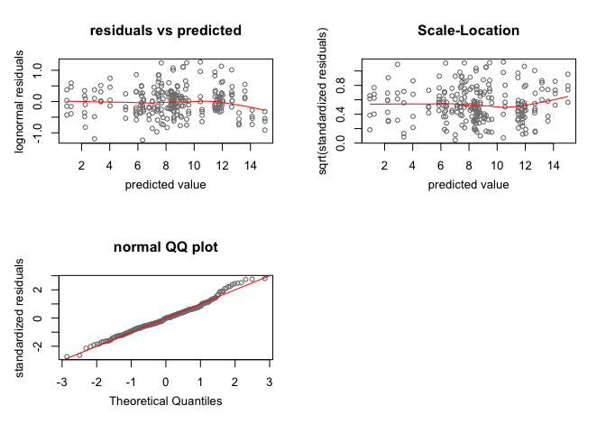<!-- -->

From the above plots, it appears that the linear modeling approach is indeed valid.

## Gene expression plots
I still need to annotate the resulting plots with asterisks to denote signficance. 


```r
## trellisbyGene
smm2 <- HPDsummary(informed_d,qs,xgroup="genotype")
```

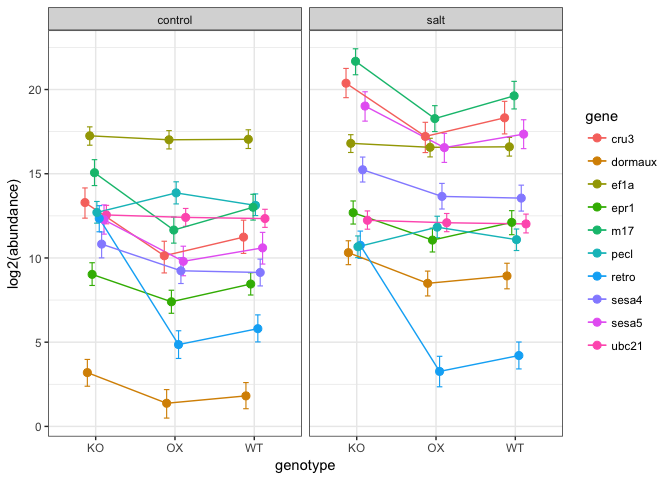<!-- -->

```r
#smm.norms <- HPDsummary(norms, qs, xgroup = "genotype")
#
trellisByGene(smm2,xFactor="genotype",groupFactor="condition")+xlab("genotype")
```

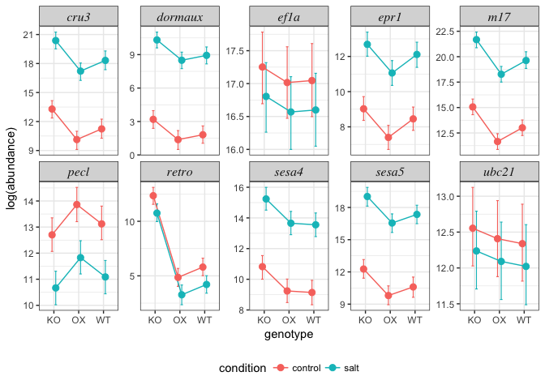<!-- -->

```r
#trellisByGene(smm.norms,xFactor="genotype",groupFactor="condition")+xlab("genotype")

## test plots
## housekeepers only
# HPDsummary(model = informed_d, data = qs, xgroup = "genotype", genes = c("ef1a", "ubc21"), x.order = c("KO", "WT", "OX"))

## now one by one
# HPDsummary(model = informed_d, data = qs, xgroup = "genotype", genes = c("retro"),
#            x.order = c("KO", "WT", "OX"))
# HPDsummary(model = informed_d, data = qs, xgroup = "genotype", genes = c("sesa4"),
#            x.order = c("KO", "WT", "OX"))
# HPDsummary(model = informed_d, data = qs, xgroup = "genotype", genes = c("sesa5"),
#            x.order = c("KO", "WT", "OX"))
# HPDsummary(model = informed_d, data = qs, xgroup = "genotype", genes = c("m17"),
#            x.order = c("KO", "WT", "OX"))
# HPDsummary(model = informed_d, data = qs, xgroup = "genotype", genes = c("epr1"),
#            x.order = c("KO", "WT", "OX"))
# HPDsummary(model = informed_d, data = qs, xgroup = "genotype", genes = c("pecl"),
#            x.order = c("KO", "WT", "OX"))
# HPDsummary(model = informed_d, data = qs, xgroup = "genotype", genes = c("cru3"),
#            x.order = c("KO", "WT", "OX"))
# HPDsummary(model = informed_d, data = qs, xgroup = "genotype", genes = c("dormaux"),
#            x.order = c("KO", "WT", "OX"))

## filtering
## get the plotting data out of the summary object
ggplotData <- smm2$ggPlot$data
## refactor to put genotype in right order
ggplotData$genotype <- factor(ggplotData$genotype, levels = c("KO", "WT", "OX"))

## pull out individual genes
retro <- ggplotData %>% filter(gene == "retro")
## get pvalues, include NA for the WT v WT comparisons
retro$pvalue <- smm2$geneWise$retro[lower.tri(smm2$geneWise$retro, diag = TRUE)][c(5,11,14,18,1,1)]
## assign star labels
retro$star <- ""
retro$star[retro$pvalue <= 0.05] <- "*"
retro$star[retro$pvalue <= 0.01] <- "**"
retro$star[retro$pvalue <= 0.001] <- "***"

cru3 <- ggplotData %>% filter(gene == "cru3")
## get pvalues
cru3$pvalue <- smm2$geneWise$cru3[lower.tri(smm2$geneWise$cru3, diag = TRUE)][c(5,11,14,18,1,1)]
## assign star labels
cru3$star <- ""
cru3$star[cru3$pvalue <= 0.05] <- "*"
cru3$star[cru3$pvalue <= 0.01] <- "**"
cru3$star[cru3$pvalue <= 0.001] <- "***"

sesa4 <- ggplotData %>% filter(gene == "sesa4")
## get pvalues
sesa4$pvalue <- smm2$geneWise$sesa4[lower.tri(smm2$geneWise$sesa4, diag = TRUE)][c(5,11,14,18,1,1)]
## assign star labels
sesa4$star <- ""
sesa4$star[sesa4$pvalue <= 0.05] <- "*"
sesa4$star[sesa4$pvalue <= 0.01] <- "**"
sesa4$star[sesa4$pvalue <= 0.001] <- "***"

sesa5 <- ggplotData %>% filter(gene == "sesa5")
## get pvalues
sesa5$pvalue <- smm2$geneWise$sesa5[lower.tri(smm2$geneWise$sesa5, diag = TRUE)][c(5,11,14,18,1,1)]
## assign star labels
sesa5$star <- ""
sesa5$star[sesa5$pvalue <= 0.05] <- "*"
sesa5$star[sesa5$pvalue <= 0.01] <- "**"
sesa5$star[sesa5$pvalue <= 0.001] <- "***"

m17 <- ggplotData %>% filter(gene == "m17")
## get pvalues
m17$pvalue <- smm2$geneWise$m17[lower.tri(smm2$geneWise$m17, diag = TRUE)][c(5,11,14,18,1,1)]
## assign star labels
m17$star <- ""
m17$star[m17$pvalue <= 0.05] <- "*"
m17$star[m17$pvalue <= 0.01] <- "**"
m17$star[m17$pvalue <= 0.001] <- "***"

epr1 <- ggplotData %>% filter(gene == "epr1")
## get pvalues
epr1$pvalue <- smm2$geneWise$epr1[lower.tri(smm2$geneWise$epr1, diag = TRUE)][c(5,11,14,18,1,1)]
## assign star labels
epr1$star <- ""
epr1$star[epr1$pvalue <= 0.05] <- "*"
epr1$star[epr1$pvalue <= 0.01] <- "**"
epr1$star[epr1$pvalue <= 0.001] <- "***"

pecl <- ggplotData %>% filter(gene == "pecl")
## get pvalues
pecl$pvalue <- smm2$geneWise$pecl[lower.tri(smm2$geneWise$pecl, diag = TRUE)][c(5,11,14,18,1,1)]
## assign star labels
pecl$star <- ""
pecl$star[pecl$pvalue <= 0.05] <- "*"
pecl$star[pecl$pvalue <= 0.01] <- "**"
pecl$star[pecl$pvalue <= 0.001] <- "***"

dormaux <- ggplotData %>% filter(gene == "dormaux")
## get pvalues
dormaux$pvalue <- smm2$geneWise$dormaux[lower.tri(smm2$geneWise$dormaux, diag = TRUE)][c(5,11,14,18,1,1)]
## assign star labels
dormaux$star <- ""
dormaux$star[dormaux$pvalue <= 0.05] <- "*"
dormaux$star[dormaux$pvalue <= 0.01] <- "**"
dormaux$star[dormaux$pvalue <= 0.001] <- "***"
```
## Individual Gene Plots non-normalized

```r
ggplot(retro, aes(x = genotype, y = mean, colour = condition, group = condition)) + 
        geom_errorbar(aes(ymin = lower, ymax = upper), width = 0.1) +
        scale_color_manual(values=c("#00BFC4", "#F8766D")) +
        geom_point(size = 3) +
        geom_text(aes(label = star, y = upper + 0.2), colour = "black", size = 5) +
        ylab("log2(abundance)") +
        ggtitle("retro") +
        theme_bw() +
        theme(plot.title = element_text(size = 20, hjust=0.5), panel.grid.major.x = element_blank())
```

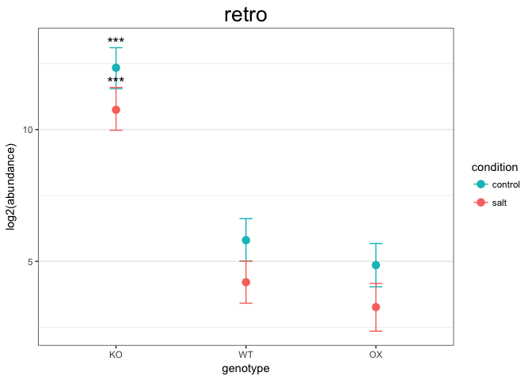<!-- -->

```r
ggplot(cru3, aes(x = genotype, y = mean, colour = condition, group = condition)) + 
        geom_errorbar(aes(ymin = lower, ymax = upper), width = 0.1) +
        scale_color_manual(values=c("#00BFC4", "#F8766D")) +
        geom_point(size = 3) +
        geom_text(aes(label = star, y = upper + 0.2), colour = "black", size = 5) +
        ylab("log2(abundance)") +
        ggtitle("cru3") +
        theme_bw() +
        theme(plot.title = element_text(size = 20, hjust=0.5))
```

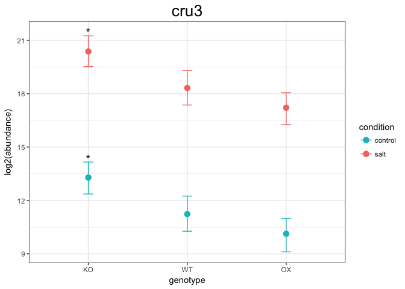<!-- -->

```r
ggplot(sesa4, aes(x = genotype, y = mean, colour = condition, group = condition)) + 
        geom_errorbar(aes(ymin = lower, ymax = upper), width = 0.1) +
        scale_color_manual(values=c("#00BFC4", "#F8766D")) +
        geom_point(size = 3) +
        geom_text(aes(label = star, y = upper + 0.2), colour = "black", size = 5) +
        ylab("log2(abundance)") +
        ggtitle("sesa4") +
        theme_bw() +
        theme(plot.title = element_text(size = 20, hjust=0.5))
```

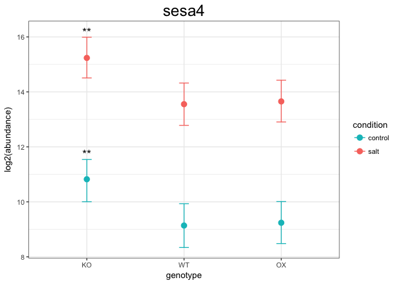<!-- -->

```r
ggplot(sesa5, aes(x = genotype, y = mean, colour = condition, group = condition)) + 
        geom_errorbar(aes(ymin = lower, ymax = upper), width = 0.1) +
        scale_color_manual(values=c("#00BFC4", "#F8766D")) +
        geom_point(size = 3) +
        geom_text(aes(label = star, y = upper + 0.2), colour = "black", size = 5) +
        ylab("log2(abundance)") +
        ggtitle("sesa5") +
        theme_bw() +
        theme(plot.title = element_text(size = 20, hjust=0.5))
```

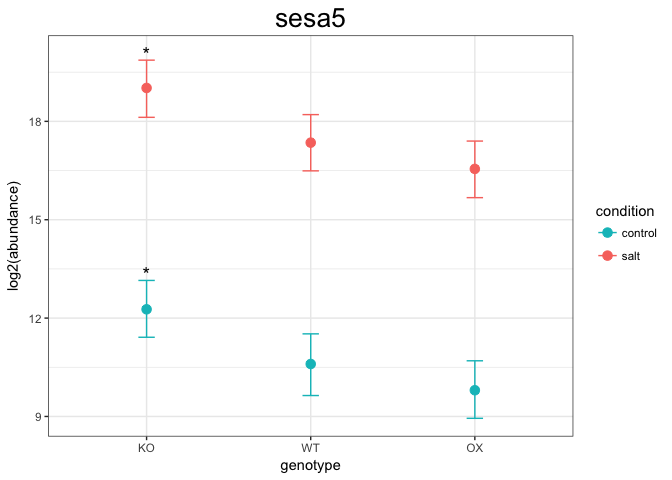<!-- -->

```r
ggplot(m17, aes(x = genotype, y = mean, colour = condition, group = condition)) + 
        geom_errorbar(aes(ymin = lower, ymax = upper), width = 0.1) +
        scale_color_manual(values=c("#00BFC4", "#F8766D")) +
        geom_point(size = 3) +
        geom_text(aes(label = star, y = upper + 0.2), colour = "black", size = 5) +
        ylab("log2(abundance)") +
        ggtitle("m17") +
        theme_bw() +
        theme(plot.title = element_text(size = 20, hjust=0.5))
```

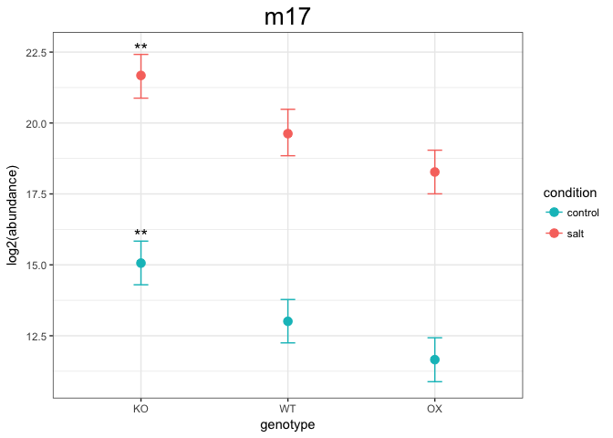<!-- -->

```r
ggplot(epr1, aes(x = genotype, y = mean, colour = condition, group = condition)) + 
        geom_errorbar(aes(ymin = lower, ymax = upper), width = 0.1) +
        scale_color_manual(values=c("#00BFC4", "#F8766D")) +
        geom_point(size = 3) +
        geom_text(aes(label = star, y = upper + 0.2), colour = "black", size = 5) +
        ylab("log2(abundance)") +
        ggtitle("epr1") +
        theme_bw() +
        theme(plot.title = element_text(size = 20, hjust=0.5))
```

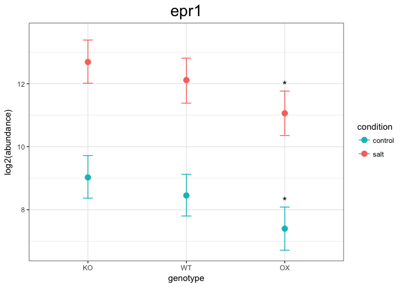<!-- -->

```r
ggplot(pecl, aes(x = genotype, y = mean, colour = condition, group = condition)) + 
        geom_errorbar(aes(ymin = lower, ymax = upper), width = 0.1) +
        scale_color_manual(values=c("#00BFC4", "#F8766D")) +
        geom_point(size = 3) +
        geom_text(aes(label = star, y = upper + 0.2), colour = "black", size = 5) +
        ylab("log2(abundance)") +
        ggtitle("pecl") +
        theme_bw() +
        theme(plot.title = element_text(size = 20, hjust=0.5))
```

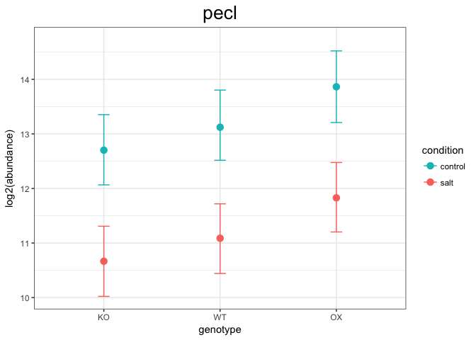<!-- -->

```r
ggplot(dormaux, aes(x = genotype, y = mean, colour = condition, group = condition)) + 
        geom_errorbar(aes(ymin = lower, ymax = upper), width = 0.1) +
        scale_color_manual(values=c("#00BFC4", "#F8766D")) +
        geom_point(size = 3) +
        geom_text(aes(label = star, y = upper + 0.2), colour = "black", size = 5) +
        ylab("log2(abundance)") +
        ggtitle("dormaux") +
        theme_bw() +
        theme(plot.title = element_text(size = 20, hjust=0.5))
```

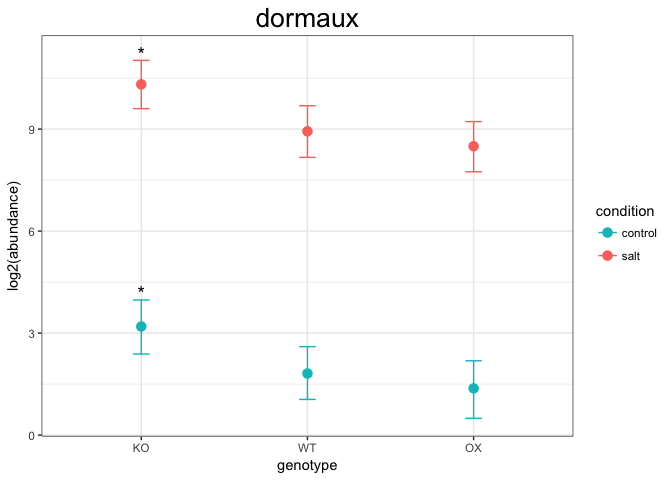<!-- -->


## Statistical significance

```r
smm2$geneWise
```

```
## $cru3
##                              difference
## pvalue                        genotypeKO:conditioncontrol
##   genotypeKO:conditioncontrol                          NA
##   genotypeKO:conditionsalt                   0.000000e+00
##   genotypeOX:conditioncontrol                1.036787e-03
##   genotypeOX:conditionsalt                   1.869447e-04
##   genotypeWT:conditioncontrol                3.090534e-02
##   genotypeWT:conditionsalt                   4.378368e-06
##                              difference
## pvalue                        genotypeKO:conditionsalt
##   genotypeKO:conditioncontrol             7.084066e+00
##   genotypeKO:conditionsalt                          NA
##   genotypeOX:conditioncontrol             3.996803e-15
##   genotypeOX:conditionsalt                1.036787e-03
##   genotypeWT:conditioncontrol             2.604583e-13
##   genotypeWT:conditionsalt                3.090534e-02
##                              difference
## pvalue                        genotypeOX:conditioncontrol
##   genotypeKO:conditioncontrol               -3.158620e+00
##   genotypeKO:conditionsalt                  -1.024269e+01
##   genotypeOX:conditioncontrol                          NA
##   genotypeOX:conditionsalt                   0.000000e+00
##   genotypeWT:conditioncontrol                2.185947e-01
##   genotypeWT:conditionsalt                   4.566569e-12
##                              difference
## pvalue                        genotypeOX:conditionsalt
##   genotypeKO:conditioncontrol             3.925446e+00
##   genotypeKO:conditionsalt               -3.158620e+00
##   genotypeOX:conditioncontrol             7.084066e+00
##   genotypeOX:conditionsalt                          NA
##   genotypeWT:conditioncontrol             3.028192e-08
##   genotypeWT:conditionsalt                2.185947e-01
##                              difference
## pvalue                        genotypeWT:conditioncontrol
##   genotypeKO:conditioncontrol                   -2.053146
##   genotypeKO:conditionsalt                      -9.137211
##   genotypeOX:conditioncontrol                    1.105474
##   genotypeOX:conditionsalt                      -5.978592
##   genotypeWT:conditioncontrol                          NA
##   genotypeWT:conditionsalt                       0.000000
##                              difference
## pvalue                        genotypeWT:conditionsalt
##   genotypeKO:conditioncontrol                 5.030920
##   genotypeKO:conditionsalt                   -2.053146
##   genotypeOX:conditioncontrol                 8.189539
##   genotypeOX:conditionsalt                    1.105474
##   genotypeWT:conditioncontrol                 7.084066
##   genotypeWT:conditionsalt                          NA
## 
## $dormaux
##                              difference
## pvalue                        genotypeKO:conditioncontrol
##   genotypeKO:conditioncontrol                          NA
##   genotypeKO:conditionsalt                   0.000000e+00
##   genotypeOX:conditioncontrol                1.435248e-03
##   genotypeOX:conditionsalt                   1.296740e-13
##   genotypeWT:conditioncontrol                1.367087e-02
##   genotypeWT:conditionsalt                   1.421085e-14
##                              difference
## pvalue                        genotypeKO:conditionsalt
##   genotypeKO:conditioncontrol              7.120863977
##   genotypeKO:conditionsalt                          NA
##   genotypeOX:conditioncontrol              0.000000000
##   genotypeOX:conditionsalt                 0.001435248
##   genotypeWT:conditioncontrol              0.000000000
##   genotypeWT:conditionsalt                 0.013670866
##                              difference
## pvalue                        genotypeOX:conditioncontrol
##   genotypeKO:conditioncontrol                   -1.820472
##   genotypeKO:conditionsalt                      -8.941336
##   genotypeOX:conditioncontrol                          NA
##   genotypeOX:conditionsalt                       0.000000
##   genotypeWT:conditioncontrol                    0.481714
##   genotypeWT:conditionsalt                       0.000000
##                              difference
## pvalue                        genotypeOX:conditionsalt
##   genotypeKO:conditioncontrol                 5.300392
##   genotypeKO:conditionsalt                   -1.820472
##   genotypeOX:conditioncontrol                 7.120864
##   genotypeOX:conditionsalt                          NA
##   genotypeWT:conditioncontrol                 0.000000
##   genotypeWT:conditionsalt                    0.481714
##                              difference
## pvalue                        genotypeWT:conditioncontrol
##   genotypeKO:conditioncontrol                  -1.3821299
##   genotypeKO:conditionsalt                     -8.5029938
##   genotypeOX:conditioncontrol                   0.4383423
##   genotypeOX:conditionsalt                     -6.6825217
##   genotypeWT:conditioncontrol                          NA
##   genotypeWT:conditionsalt                      0.0000000
##                              difference
## pvalue                        genotypeWT:conditionsalt
##   genotypeKO:conditioncontrol                5.7387341
##   genotypeKO:conditionsalt                  -1.3821299
##   genotypeOX:conditioncontrol                7.5592063
##   genotypeOX:conditionsalt                   0.4383423
##   genotypeWT:conditioncontrol                7.1208640
##   genotypeWT:conditionsalt                          NA
## 
## $epr1
##                              difference
## pvalue                        genotypeKO:conditioncontrol
##   genotypeKO:conditioncontrol                          NA
##   genotypeKO:conditionsalt                   0.000000e+00
##   genotypeOX:conditioncontrol                1.989330e-03
##   genotypeOX:conditionsalt                   2.575023e-03
##   genotypeWT:conditioncontrol                2.576360e-01
##   genotypeWT:conditionsalt                   3.261302e-06
##                              difference
## pvalue                        genotypeKO:conditionsalt
##   genotypeKO:conditioncontrol             3.661035e+00
##   genotypeKO:conditionsalt                          NA
##   genotypeOX:conditioncontrol             8.437695e-15
##   genotypeOX:conditionsalt                1.989330e-03
##   genotypeWT:conditioncontrol             1.637404e-10
##   genotypeWT:conditionsalt                2.576360e-01
##                              difference
## pvalue                        genotypeOX:conditioncontrol
##   genotypeKO:conditioncontrol               -1.626630e+00
##   genotypeKO:conditionsalt                  -5.287664e+00
##   genotypeOX:conditioncontrol                          NA
##   genotypeOX:conditionsalt                   0.000000e+00
##   genotypeWT:conditioncontrol                4.063249e-02
##   genotypeWT:conditionsalt                   2.477574e-12
##                              difference
## pvalue                        genotypeOX:conditionsalt
##   genotypeKO:conditioncontrol             2.034405e+00
##   genotypeKO:conditionsalt               -1.626630e+00
##   genotypeOX:conditioncontrol             3.661035e+00
##   genotypeOX:conditionsalt                          NA
##   genotypeWT:conditioncontrol             8.890684e-05
##   genotypeWT:conditionsalt                4.063249e-02
##                              difference
## pvalue                        genotypeWT:conditioncontrol
##   genotypeKO:conditioncontrol                  -0.5732309
##   genotypeKO:conditionsalt                     -4.2342655
##   genotypeOX:conditioncontrol                   1.0533988
##   genotypeOX:conditionsalt                     -2.6076358
##   genotypeWT:conditioncontrol                          NA
##   genotypeWT:conditionsalt                      0.0000000
##                              difference
## pvalue                        genotypeWT:conditionsalt
##   genotypeKO:conditioncontrol                3.0878037
##   genotypeKO:conditionsalt                  -0.5732309
##   genotypeOX:conditioncontrol                4.7144334
##   genotypeOX:conditionsalt                   1.0533988
##   genotypeWT:conditioncontrol                3.6610346
##   genotypeWT:conditionsalt                          NA
## 
## $m17
##                              difference
## pvalue                        genotypeKO:conditioncontrol
##   genotypeKO:conditioncontrol                          NA
##   genotypeKO:conditionsalt                   0.000000e+00
##   genotypeOX:conditioncontrol                4.308777e-06
##   genotypeOX:conditionsalt                   6.274278e-04
##   genotypeWT:conditioncontrol                2.477747e-03
##   genotypeWT:conditionsalt                   9.554894e-08
##                              difference
## pvalue                        genotypeKO:conditionsalt
##   genotypeKO:conditioncontrol             6.615783e+00
##   genotypeKO:conditionsalt                          NA
##   genotypeOX:conditioncontrol             0.000000e+00
##   genotypeOX:conditionsalt                4.308777e-06
##   genotypeWT:conditioncontrol             0.000000e+00
##   genotypeWT:conditionsalt                2.477747e-03
##                              difference
## pvalue                        genotypeOX:conditioncontrol
##   genotypeKO:conditioncontrol                 -3.40313830
##   genotypeKO:conditionsalt                   -10.01892093
##   genotypeOX:conditioncontrol                          NA
##   genotypeOX:conditionsalt                     0.00000000
##   genotypeWT:conditioncontrol                  0.06124694
##   genotypeWT:conditionsalt                     0.00000000
##                              difference
## pvalue                        genotypeOX:conditionsalt
##   genotypeKO:conditioncontrol             3.212644e+00
##   genotypeKO:conditionsalt               -3.403138e+00
##   genotypeOX:conditioncontrol             6.615783e+00
##   genotypeOX:conditionsalt                          NA
##   genotypeWT:conditioncontrol             1.667266e-08
##   genotypeWT:conditionsalt                6.124694e-02
##                              difference
## pvalue                        genotypeWT:conditioncontrol
##   genotypeKO:conditioncontrol                   -2.051867
##   genotypeKO:conditionsalt                      -8.667650
##   genotypeOX:conditioncontrol                    1.351271
##   genotypeOX:conditionsalt                      -5.264512
##   genotypeWT:conditioncontrol                          NA
##   genotypeWT:conditionsalt                       0.000000
##                              difference
## pvalue                        genotypeWT:conditionsalt
##   genotypeKO:conditioncontrol                 4.563915
##   genotypeKO:conditionsalt                   -2.051867
##   genotypeOX:conditioncontrol                 7.967053
##   genotypeOX:conditionsalt                    1.351271
##   genotypeWT:conditioncontrol                 6.615783
##   genotypeWT:conditionsalt                          NA
## 
## $pecl
##                              difference
## pvalue                        genotypeKO:conditioncontrol
##   genotypeKO:conditioncontrol                          NA
##   genotypeKO:conditionsalt                   3.272857e-07
##   genotypeOX:conditioncontrol                1.378908e-02
##   genotypeOX:conditionsalt                   1.562790e-01
##   genotypeWT:conditioncontrol                3.834479e-01
##   genotypeWT:conditionsalt                   1.003553e-02
##                              difference
## pvalue                        genotypeKO:conditionsalt
##   genotypeKO:conditioncontrol            -2.034879e+00
##   genotypeKO:conditionsalt                          NA
##   genotypeOX:conditioncontrol             2.405738e-07
##   genotypeOX:conditionsalt                1.378908e-02
##   genotypeWT:conditioncontrol             8.334941e-05
##   genotypeWT:conditionsalt                3.834479e-01
##                              difference
## pvalue                        genotypeOX:conditioncontrol
##   genotypeKO:conditioncontrol                1.161585e+00
##   genotypeKO:conditionsalt                   3.196463e+00
##   genotypeOX:conditioncontrol                          NA
##   genotypeOX:conditionsalt                   3.272857e-07
##   genotypeWT:conditioncontrol                1.301250e-01
##   genotypeWT:conditionsalt                   1.204644e-05
##                              difference
## pvalue                        genotypeOX:conditionsalt
##   genotypeKO:conditioncontrol              -0.87329372
##   genotypeKO:conditionsalt                  1.16158479
##   genotypeOX:conditioncontrol              -2.03487852
##   genotypeOX:conditionsalt                          NA
##   genotypeWT:conditioncontrol               0.03953321
##   genotypeWT:conditionsalt                  0.13012498
##                              difference
## pvalue                        genotypeWT:conditioncontrol
##   genotypeKO:conditioncontrol                4.203119e-01
##   genotypeKO:conditionsalt                   2.455190e+00
##   genotypeOX:conditioncontrol               -7.412729e-01
##   genotypeOX:conditionsalt                   1.293606e+00
##   genotypeWT:conditioncontrol                          NA
##   genotypeWT:conditionsalt                   3.272857e-07
##                              difference
## pvalue                        genotypeWT:conditionsalt
##   genotypeKO:conditioncontrol               -1.6145666
##   genotypeKO:conditionsalt                   0.4203119
##   genotypeOX:conditioncontrol               -2.7761514
##   genotypeOX:conditionsalt                  -0.7412729
##   genotypeWT:conditioncontrol               -2.0348785
##   genotypeWT:conditionsalt                          NA
## 
## $retro
##                              difference
## pvalue                        genotypeKO:conditioncontrol
##   genotypeKO:conditioncontrol                          NA
##   genotypeKO:conditionsalt                    0.002211908
##   genotypeOX:conditioncontrol                 0.000000000
##   genotypeOX:conditionsalt                    0.000000000
##   genotypeWT:conditioncontrol                 0.000000000
##   genotypeWT:conditionsalt                    0.000000000
##                              difference
## pvalue                        genotypeKO:conditionsalt
##   genotypeKO:conditioncontrol            -1.593719e+00
##   genotypeKO:conditionsalt                          NA
##   genotypeOX:conditioncontrol             1.221245e-14
##   genotypeOX:conditionsalt                0.000000e+00
##   genotypeWT:conditioncontrol             6.613798e-11
##   genotypeWT:conditionsalt                0.000000e+00
##                              difference
## pvalue                        genotypeOX:conditioncontrol
##   genotypeKO:conditioncontrol                -7.486242299
##   genotypeKO:conditionsalt                   -5.892523168
##   genotypeOX:conditioncontrol                          NA
##   genotypeOX:conditionsalt                    0.002211908
##   genotypeWT:conditioncontrol                 0.123654066
##   genotypeWT:conditionsalt                    0.400369080
##                              difference
## pvalue                        genotypeOX:conditionsalt
##   genotypeKO:conditioncontrol             -9.079961429
##   genotypeKO:conditionsalt                -7.486242299
##   genotypeOX:conditioncontrol             -1.593719130
##   genotypeOX:conditionsalt                          NA
##   genotypeWT:conditioncontrol              0.002395566
##   genotypeWT:conditionsalt                 0.123654066
##                              difference
## pvalue                        genotypeWT:conditioncontrol
##   genotypeKO:conditioncontrol                -6.541841822
##   genotypeKO:conditionsalt                   -4.948122691
##   genotypeOX:conditioncontrol                 0.944400477
##   genotypeOX:conditionsalt                    2.538119607
##   genotypeWT:conditioncontrol                          NA
##   genotypeWT:conditionsalt                    0.002211908
##                              difference
## pvalue                        genotypeWT:conditionsalt
##   genotypeKO:conditioncontrol               -8.1355610
##   genotypeKO:conditionsalt                  -6.5418418
##   genotypeOX:conditioncontrol               -0.6493187
##   genotypeOX:conditionsalt                   0.9444005
##   genotypeWT:conditioncontrol               -1.5937191
##   genotypeWT:conditionsalt                          NA
## 
## $sesa4
##                              difference
## pvalue                        genotypeKO:conditioncontrol
##   genotypeKO:conditioncontrol                          NA
##   genotypeKO:conditionsalt                   0.0000000000
##   genotypeOX:conditioncontrol                0.0053376853
##   genotypeOX:conditionsalt                   0.0002091425
##   genotypeWT:conditioncontrol                0.0034548176
##   genotypeWT:conditionsalt                   0.0003721186
##                              difference
## pvalue                        genotypeKO:conditionsalt
##   genotypeKO:conditioncontrol             4.414343e+00
##   genotypeKO:conditionsalt                          NA
##   genotypeOX:conditioncontrol             8.881784e-16
##   genotypeOX:conditionsalt                5.337685e-03
##   genotypeWT:conditioncontrol             6.661338e-16
##   genotypeWT:conditionsalt                3.454818e-03
##                              difference
## pvalue                        genotypeOX:conditioncontrol
##   genotypeKO:conditioncontrol               -1.583077e+00
##   genotypeKO:conditionsalt                  -5.997420e+00
##   genotypeOX:conditioncontrol                          NA
##   genotypeOX:conditionsalt                   0.000000e+00
##   genotypeWT:conditioncontrol                8.615099e-01
##   genotypeWT:conditionsalt                   1.395121e-08
##                              difference
## pvalue                        genotypeOX:conditionsalt
##   genotypeKO:conditioncontrol             2.831267e+00
##   genotypeKO:conditionsalt               -1.583077e+00
##   genotypeOX:conditioncontrol             4.414343e+00
##   genotypeOX:conditionsalt                          NA
##   genotypeWT:conditioncontrol             3.504226e-09
##   genotypeWT:conditionsalt                8.615099e-01
##                              difference
## pvalue                        genotypeWT:conditioncontrol
##   genotypeKO:conditioncontrol                  -1.6838418
##   genotypeKO:conditionsalt                     -6.0981853
##   genotypeOX:conditioncontrol                  -0.1007651
##   genotypeOX:conditionsalt                     -4.5151086
##   genotypeWT:conditioncontrol                          NA
##   genotypeWT:conditionsalt                      0.0000000
##                              difference
## pvalue                        genotypeWT:conditionsalt
##   genotypeKO:conditioncontrol                2.7305016
##   genotypeKO:conditionsalt                  -1.6838418
##   genotypeOX:conditioncontrol                4.3135784
##   genotypeOX:conditionsalt                  -0.1007651
##   genotypeWT:conditioncontrol                4.4143435
##   genotypeWT:conditionsalt                          NA
## 
## $sesa5
##                              difference
## pvalue                        genotypeKO:conditioncontrol
##   genotypeKO:conditioncontrol                          NA
##   genotypeKO:conditionsalt                   0.000000e+00
##   genotypeOX:conditioncontrol                1.403849e-03
##   genotypeOX:conditionsalt                   4.118525e-06
##   genotypeWT:conditioncontrol                1.991451e-02
##   genotypeWT:conditionsalt                   4.289484e-09
##                              difference
## pvalue                        genotypeKO:conditionsalt
##   genotypeKO:conditioncontrol              6.750792136
##   genotypeKO:conditionsalt                          NA
##   genotypeOX:conditioncontrol              0.000000000
##   genotypeOX:conditionsalt                 0.001403849
##   genotypeWT:conditioncontrol              0.000000000
##   genotypeWT:conditionsalt                 0.019914512
##                              difference
## pvalue                        genotypeOX:conditioncontrol
##   genotypeKO:conditioncontrol               -2.468251e+00
##   genotypeKO:conditionsalt                  -9.219043e+00
##   genotypeOX:conditioncontrol                          NA
##   genotypeOX:conditionsalt                   0.000000e+00
##   genotypeWT:conditioncontrol                3.276643e-01
##   genotypeWT:conditionsalt                   1.798561e-14
##                              difference
## pvalue                        genotypeOX:conditionsalt
##   genotypeKO:conditioncontrol             4.282541e+00
##   genotypeKO:conditionsalt               -2.468251e+00
##   genotypeOX:conditioncontrol             6.750792e+00
##   genotypeOX:conditionsalt                          NA
##   genotypeWT:conditioncontrol             4.872429e-09
##   genotypeWT:conditionsalt                3.276643e-01
##                              difference
## pvalue                        genotypeWT:conditioncontrol
##   genotypeKO:conditioncontrol                   -1.667933
##   genotypeKO:conditionsalt                      -8.418725
##   genotypeOX:conditioncontrol                    0.800318
##   genotypeOX:conditionsalt                      -5.950474
##   genotypeWT:conditioncontrol                          NA
##   genotypeWT:conditionsalt                       0.000000
##                              difference
## pvalue                        genotypeWT:conditionsalt
##   genotypeKO:conditioncontrol                 5.082859
##   genotypeKO:conditionsalt                   -1.667933
##   genotypeOX:conditioncontrol                 7.551110
##   genotypeOX:conditionsalt                    0.800318
##   genotypeWT:conditioncontrol                 6.750792
##   genotypeWT:conditionsalt                          NA
## 
## $ubc21
##                              difference
## pvalue                        genotypeKO:conditioncontrol
##   genotypeKO:conditioncontrol                          NA
##   genotypeKO:conditionsalt                      0.3590681
##   genotypeOX:conditioncontrol                   0.7051200
##   genotypeOX:conditionsalt                      0.3765195
##   genotypeWT:conditioncontrol                   0.5823570
##   genotypeWT:conditionsalt                      0.3218389
##                              difference
## pvalue                        genotypeKO:conditionsalt
##   genotypeKO:conditioncontrol               -0.3171701
##   genotypeKO:conditionsalt                          NA
##   genotypeOX:conditioncontrol                0.7378120
##   genotypeOX:conditionsalt                   0.7051200
##   genotypeWT:conditioncontrol                0.8407438
##   genotypeWT:conditionsalt                   0.5823570
##                              difference
## pvalue                        genotypeOX:conditioncontrol
##   genotypeKO:conditioncontrol                  -0.1458121
##   genotypeKO:conditionsalt                      0.1713580
##   genotypeOX:conditioncontrol                          NA
##   genotypeOX:conditionsalt                      0.3590681
##   genotypeWT:conditioncontrol                   0.8577649
##   genotypeWT:conditionsalt                      0.4649343
##                              difference
## pvalue                        genotypeOX:conditionsalt
##   genotypeKO:conditioncontrol               -0.4629822
##   genotypeKO:conditionsalt                  -0.1458121
##   genotypeOX:conditioncontrol               -0.3171701
##   genotypeOX:conditionsalt                          NA
##   genotypeWT:conditioncontrol                0.6272157
##   genotypeWT:conditionsalt                   0.8577649
##                              difference
## pvalue                        genotypeWT:conditioncontrol
##   genotypeKO:conditioncontrol                 -0.21532468
##   genotypeKO:conditionsalt                     0.10184542
##   genotypeOX:conditioncontrol                 -0.06951255
##   genotypeOX:conditionsalt                     0.24765754
##   genotypeWT:conditioncontrol                          NA
##   genotypeWT:conditionsalt                     0.35906809
##                              difference
## pvalue                        genotypeWT:conditionsalt
##   genotypeKO:conditioncontrol              -0.53249477
##   genotypeKO:conditionsalt                 -0.21532468
##   genotypeOX:conditioncontrol              -0.38668264
##   genotypeOX:conditionsalt                 -0.06951255
##   genotypeWT:conditioncontrol              -0.31717009
##   genotypeWT:conditionsalt                          NA
## 
## $ef1a
##                              difference
## pvalue                        genotypeKO:conditioncontrol
##   genotypeKO:conditioncontrol                          NA
##   genotypeKO:conditionsalt                      0.1780070
##   genotypeOX:conditioncontrol                   0.5358461
##   genotypeOX:conditionsalt                      0.1803961
##   genotypeWT:conditioncontrol                   0.5908814
##   genotypeWT:conditionsalt                      0.1973994
##                              difference
## pvalue                        genotypeKO:conditionsalt
##   genotypeKO:conditioncontrol               -0.4470649
##   genotypeKO:conditionsalt                          NA
##   genotypeOX:conditioncontrol                0.6737746
##   genotypeOX:conditionsalt                   0.5358461
##   genotypeWT:conditioncontrol                0.6348311
##   genotypeWT:conditionsalt                   0.5908814
##                              difference
## pvalue                        genotypeOX:conditioncontrol
##   genotypeKO:conditioncontrol                  -0.2361087
##   genotypeKO:conditionsalt                      0.2109562
##   genotypeOX:conditioncontrol                          NA
##   genotypeOX:conditionsalt                      0.1780070
##   genotypeWT:conditioncontrol                   0.9420963
##   genotypeWT:conditionsalt                      0.4276367
##                              difference
## pvalue                        genotypeOX:conditionsalt
##   genotypeKO:conditioncontrol               -0.6831736
##   genotypeKO:conditionsalt                  -0.2361087
##   genotypeOX:conditioncontrol               -0.4470649
##   genotypeOX:conditionsalt                          NA
##   genotypeWT:conditioncontrol                0.3724149
##   genotypeWT:conditionsalt                   0.9420963
##                              difference
## pvalue                        genotypeWT:conditioncontrol
##   genotypeKO:conditioncontrol                 -0.20606554
##   genotypeKO:conditionsalt                     0.24099937
##   genotypeOX:conditioncontrol                  0.03004321
##   genotypeOX:conditionsalt                     0.47710811
##   genotypeWT:conditioncontrol                          NA
##   genotypeWT:conditionsalt                     0.17800698
##                              difference
## pvalue                        genotypeWT:conditionsalt
##   genotypeKO:conditioncontrol              -0.65313044
##   genotypeKO:conditionsalt                 -0.20606554
##   genotypeOX:conditioncontrol              -0.41702170
##   genotypeOX:conditionsalt                  0.03004321
##   genotypeWT:conditioncontrol              -0.44706491
##   genotypeWT:conditionsalt                          NA
```

## R session info

```r
sessionInfo()
```

```
## R version 3.3.0 (2016-05-03)
## Platform: x86_64-apple-darwin13.4.0 (64-bit)
## Running under: OS X 10.12.1 (unknown)
## 
## locale:
## [1] en_US.UTF-8/en_US.UTF-8/en_US.UTF-8/C/en_US.UTF-8/en_US.UTF-8
## 
## attached base packages:
## [1] stats     graphics  grDevices utils     datasets  methods   base     
## 
## other attached packages:
## [1] tidyr_0.6.0     dplyr_0.5.0     MCMC.qpcr_1.2.3 ggplot2_2.2.0  
## [5] MCMCglmm_2.24   ape_4.0         coda_0.19-1     Matrix_1.2-7.1 
## 
## loaded via a namespace (and not attached):
##  [1] Rcpp_0.12.8      knitr_1.15.1     magrittr_1.5     munsell_0.4.3   
##  [5] colorspace_1.2-7 cubature_1.1-2   lattice_0.20-34  R6_2.2.0        
##  [9] plyr_1.8.4       stringr_1.1.0    tools_3.3.0      parallel_3.3.0  
## [13] grid_3.3.0       nlme_3.1-128     gtable_0.2.0     DBI_0.5-1       
## [17] corpcor_1.6.8    htmltools_0.3.5  assertthat_0.1   lazyeval_0.2.0  
## [21] yaml_2.1.14      rprojroot_1.1    digest_0.6.10    tibble_1.2      
## [25] tensorA_0.36     evaluate_0.10    rmarkdown_1.2    labeling_0.3    
## [29] stringi_1.1.2    scales_0.4.1     backports_1.0.4
```

