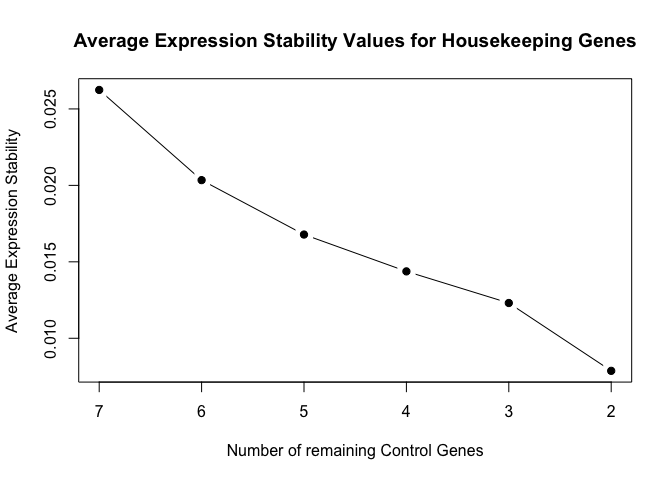

# HouseKeeping Gene Selection for qPCR Normalization
Dale Richardson  
12/1/2016  


## Description

Here, I provide all the code and justifications for data transformations that I used in order to arrive at my two chosen housekeeping genes that were used to normalize gene expression values for the SCL30a project. 

## Methods

Relative quantification data were obtained for a set of seven housekeeping genes, using SYBR green dye and an ABI Quantstudio 7 machine. The housekeeping genes were tested in six conditions:

1. Wild Type Control (meaning no salt)
2. Knockout Control
3. Over Expressor Control
4. Wild Type 200mM NaCl
5. Knockout 200mM NaCl
6. Over Expressor 200mM NaCl

For each gene and each condition, a total of 4 replicates were measured for the below genes:

1. ACT2
2. DNAB
3. EF1A
4. GAPDH
5. KU70
6. PP2AA
7. UBC21 

The .eds output file was loaded into the Thermofisher Cloud and the results were exported to a .csv file. This .csv was transformed to create a suitable input file to read in using the bioconductor packages, "ReadqPCR" and "NormqPCR". 

## Data processing


```r
## Load packages
library(ReadqPCR, quietly = TRUE, warn.conflicts = FALSE)
library(NormqPCR, quietly = TRUE, warn.conflicts = FALSE)
library(dplyr, quietly = TRUE, warn.conflicts = TRUE)
```

Read in the exported .csv file from thermofisher cloud, but ignore the comment lines beginning with "#" and only read in the columns, "Sample Name", "Target Name" and "Cq". Furthermore, rename "Sample Name" to "Sample" and "Target Name" to "Detector" as these column names are required by the ReadqPCR package. Also, I have filtered out the non-template control rows from the file as their values were all "undetermined" and do not affect in any way the selection of the housekeeping genes. 


```r
## Skip the first 11 lines, which contain comments and set na.strings

myData <- read.csv("Well\ Results.csv", header = TRUE, skip = 11, na.strings = c("","-")) %>% 
        select(Sample = Sample.Name, Detector = Target.Name, Cq) %>%
        filter(Sample != "No Sample")
```

Now, I know this is circular, but I will now output "myData" to a txt file that will be read in using the
read.qPCR function


```r
write.table(myData, file = "filteredOutput.txt", quote = FALSE, row.names = FALSE)
```

Read in the file with the read.qPCR function and run selectHKs function.


```r
filteredData <- read.qPCR("filteredOutput.txt")
```

```
## Warning in data.frame(raw.data$Detector[raw.data$Sample == sample],
## as.numeric(as.character(raw.data$Cq[raw.data$Sample == : NAs introduced by
## coercion
```

```
## Warning in read.qPCR("filteredOutput.txt"): Incompatible phenoData object. Created a new one using sample name data derived from raw data.
```

```r
## Collapse the replicates to get mean Cq for each gene for each condition
combinedData <- combineTechReps(filteredData)

## View the data
exprs(combinedData)
```

```
##            KOC      KOS      OXC      OXS      WTC      WTS
## ACT2  23.24044 25.40286 23.44137 25.07065 23.80701 25.65807
## DNAB  27.96390 28.88915 28.25702 28.70871 27.78741 28.80452
## EF1A  18.83428 20.01082 19.33216 19.95896 19.06627 20.10913
## GAPDH 24.04036 25.19984 24.26822 24.82288 23.82662 25.18336
## KU70  26.79297 27.18961 27.18248 27.02630 27.00359 27.11092
## PP2AA 27.31596 28.35741 28.45423 28.46331 27.72057 28.41586
## UBC21 24.70224 26.08482 25.60455 26.14572 25.13134 26.42517
```

```r
## Select most stable housekeepers
resHK <- selectHKs(combinedData, method = "geNorm", minNrHKs = 2, log = FALSE, 
                   Symbols = featureNames(combinedData))
```

```
## ###############################################################
```

```
## Step 1:
```

```
## stability values M:
```

```
##      UBC21       EF1A       DNAB      GAPDH      PP2AA       KU70 
## 0.02095313 0.02098144 0.02138326 0.02160731 0.02503733 0.03273964 
##       ACT2 
## 0.04098331
```

```
## average stability M:	0.0262407749784655
```

```
## variable with lowest stability (largest M value):	ACT2
```

```
## Pairwise variation, (6/7):	0.0057223406720275
```

```
## ###############################################################
```

```
## Step 2:
```

```
## stability values M:
```

```
##       DNAB      UBC21      GAPDH       EF1A      PP2AA       KU70 
## 0.01705730 0.01851239 0.01924724 0.01974079 0.02004318 0.02746166
```

```
## average stability M:	0.0203437593984211
```

```
## variable with lowest stability (largest M value):	KU70
```

```
## Pairwise variation, (5/6):	0.0043441568521292
```

```
## ###############################################################
```

```
## Step 3:
```

```
## stability values M:
```

```
##      UBC21       EF1A      GAPDH       DNAB      PP2AA 
## 0.01511928 0.01578025 0.01629495 0.01632999 0.02039957
```

```
## average stability M:	0.0167848081188158
```

```
## variable with lowest stability (largest M value):	PP2AA
```

```
## Pairwise variation, (4/5):	0.00371506038463663
```

```
## ###############################################################
```

```
## Step 4:
```

```
## stability values M:
```

```
##       EF1A      GAPDH      UBC21       DNAB 
## 0.01321604 0.01369750 0.01414305 0.01644327
```

```
## average stability M:	0.0143749644890072
```

```
## variable with lowest stability (largest M value):	DNAB
```

```
## Pairwise variation, (3/4):	0.00375615418321958
```

```
## ###############################################################
```

```
## Step 5:
```

```
## stability values M:
```

```
##       EF1A      UBC21      GAPDH 
## 0.01037149 0.01202336 0.01452514
```

```
## average stability M:	0.0123066609365512
```

```
## variable with lowest stability (largest M value):	GAPDH
```

```
## Pairwise variation, (2/3):	0.0046930839961765
```

```
## ###############################################################
```

```
## Step 6:
```

```
## stability values M:
```

```
##       UBC21        EF1A 
## 0.007869701 0.007869701
```

```
## average stability M:	0.00786970117019211
```

## Which are the most stable housekeepers?


```r
resHK
```

```
## $ranking
##       1       1       3       4       5       6       7 
##  "EF1A" "UBC21" "GAPDH"  "DNAB" "PP2AA"  "KU70"  "ACT2" 
## 
## $variation
##         6/7         5/6         4/5         3/4         2/3 
## 0.005722341 0.004344157 0.003715060 0.003756154 0.004693084 
## 
## $meanM
##           7           6           5           4           3           2 
## 0.026240775 0.020343759 0.016784808 0.014374964 0.012306661 0.007869701
```

```r
## Plot the stability values
matplot(resHK$meanM, type = "b", ylab = "Average Expression Stability", xlab = "Number of remaining Control Genes", main = "Average Expression Stability Values for Housekeeping Genes",
        xaxt = "n", pch = 19)
axis(1, at = 1:6, labels = as.character(7:2))
```

<!-- -->

Based on the above results, the two most stable housekeepers are EF1A and UBC21. I will proceed to normalize
my qPCR data using the geometric mean of these two housekeepers. 


